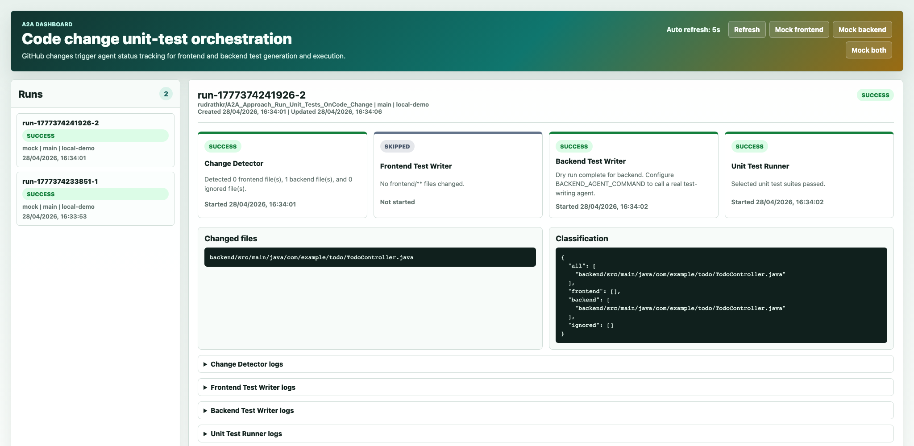

# A2A Unit Test Orchestrator

This folder contains a standalone orchestrator dashboard for the GitHub code-change flow. It listens for GitHub webhooks, classifies changed files, runs the matching A2A agents, executes the required unit tests, and shows live status in a browser UI.

## Orchestration Flow

1. GitHub sends a `push` or `pull_request` webhook to the orchestrator.
2. `agent1` starts and classifies changed files:
   - `frontend/**` means frontend code changed.
   - `backend/**` means backend code changed.
   - any other file is tracked as ignored for test-routing.
3. If frontend files changed, `agent2` starts as the frontend unit-test writer.
4. If backend files changed, `agent3` starts as the backend unit-test writer.
5. After the required writer agents finish, `agent4` starts and runs the matching unit test command.
6. The dashboard polls the orchestrator API every configured auto-refresh interval and displays each agent as green, red, running, pending, or skipped.
7. The final run status is marked `SUCCESS` only when the required agents and unit tests pass.

## Agents

1. `agent1` receives the GitHub webhook and classifies changed files.
2. `agent2` runs for `frontend/**` changes and is the frontend unit-test writer.
3. `agent3` runs for `backend/**` changes and is the backend unit-test writer.
4. `agent4` runs the required unit test suite and publishes results to the dashboard.

By default, agent2 and agent3 run in dry-run mode so this orchestrator does not modify repository files. To connect real test-writing agents later, set:

```bash
export FRONTEND_AGENT_COMMAND="your frontend test writer command"
export BACKEND_AGENT_COMMAND="your backend test writer command"
```

Those commands receive:

```text
RUN_ID
TARGET_AREA
CHANGED_FILES
REPO_ROOT
```

## Status Mapping

```text
PENDING  - agent has not started yet
RUNNING  - agent is currently executing
SUCCESS  - agent completed successfully
FAILED   - agent or command failed
SKIPPED  - agent was not required for this code change
```

The UI color mapping is:

```text
SUCCESS  -> green
FAILED   -> red
RUNNING  -> blue
PENDING  -> amber
SKIPPED  -> gray
```

## Start Orchestrator

```bash
cd Orchestrator
npm start
```

Open:

```text
http://localhost:5050
```

The running orchestrator dashboard should look like this:



Optional configuration:

```bash
export ORCHESTRATOR_PORT=5050
export AUTO_REFRESH_SECONDS=5
export GITHUB_WEBHOOK_SECRET="your webhook secret"
export GITHUB_TOKEN="token used only for pull_request file lookup"
```

The dashboard auto-refresh interval defaults to `5` seconds.

## GitHub Webhook

Create a GitHub webhook for:

```text
POST http://<your-public-host>:5050/api/github/webhook
```

Use:

```text
Content type: application/json
Events: push, pull_request
Secret: same value as GITHUB_WEBHOOK_SECRET
```

For local testing, use a tunnel such as ngrok:

```bash
ngrok http 5050
```

Copy the ngrok `Forwarding` URL and append the webhook path:

```text
https://<your-ngrok-forwarding-url>/api/github/webhook
```

Do not use the ngrok dashboard URL as the GitHub payload URL.

## Unit Test Commands Used By Agent4

Frontend:

```bash
cd frontend
npm test -- --watch=false
```

Backend:

```bash
cd backend
mvn test
```

Override them if needed:

```bash
export FRONTEND_TEST_COMMAND="npm test -- --watch=false"
export BACKEND_TEST_COMMAND="mvn test"
```

## Test The Orchestration Locally

1. Start the orchestrator:

```bash
cd Orchestrator
npm start
```

2. Open the dashboard:

```text
http://localhost:5050
```

3. Use the UI mock buttons:

```text
Mock frontend
Mock backend
Mock both
```

Expected behavior:

```text
Mock frontend -> agent1, agent2, agent4 run; agent3 is skipped
Mock backend  -> agent1, agent3, agent4 run; agent2 is skipped
Mock both     -> agent1, agent2, agent3, agent4 run
```

## Test The Webhook Endpoint

With the orchestrator running:

```bash
curl -X POST http://localhost:5050/api/github/webhook \
  -H "Content-Type: application/json" \
  -H "X-GitHub-Event: push" \
  --data @examples/github-push.sample.json
```

The UI also has mock buttons for frontend, backend, and combined runs.

## Test With Real-Time GitHub Push

1. Start the orchestrator:

```bash
cd Orchestrator
npm start
```

2. Start ngrok:

```bash
ngrok http 5050
```

3. Configure the GitHub webhook:

```text
Payload URL: https://<your-ngrok-forwarding-url>/api/github/webhook
Content type: application/json
Events: push
```

4. Push a frontend-only change:

```bash
git add frontend/<changed-file>
git commit -m "Test frontend webhook"
git push
```

Expected result:

```text
agent1 -> SUCCESS
agent2 -> SUCCESS
agent3 -> SKIPPED
agent4 -> runs frontend unit tests
```

5. Push a backend-only change:

```bash
git add backend/<changed-file>
git commit -m "Test backend webhook"
git push
```

Expected result:

```text
agent1 -> SUCCESS
agent2 -> SKIPPED
agent3 -> SUCCESS
agent4 -> runs backend unit tests
```

6. Push both frontend and backend changes to trigger all agents.

## Where Logs Appear

The unit test output is captured by the orchestrator process and shown in the dashboard. It is not written to log files inside `frontend` or `backend`.

To view logs:

1. Open `http://localhost:5050`.
2. Click the latest run in the left panel.
3. Expand `Unit Test Runner logs`.

You can also inspect a run through the API:

```bash
curl http://localhost:5050/api/runs
curl http://localhost:5050/api/runs/<runId>
```

## API

```text
GET  /api/config
GET  /api/runs
GET  /api/runs/{runId}
POST /api/github/webhook
POST /api/runs/mock?target=frontend|backend|both
```
